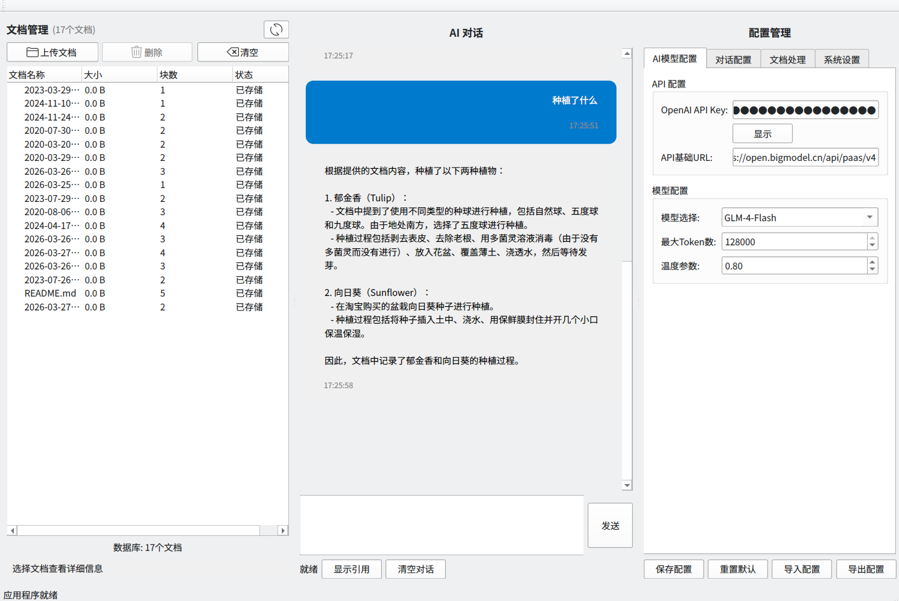

# DesktopApp

桌面文档问答应用

## 快速开始

1. 复制配置文件：
   ```
   cp config/settings.yaml.example config/settings.yaml
   ```

2. 运行程序：
   ```
   ./run.sh
   ```

## 运行示例



## 检索测试

```
python run_retrieval_test.py
```

## 功能

- 文档上传与向量化
- 多种检索方式（向量/BM25/混合搜索/重排序）
- RAG评估
- AI对话引用溯源